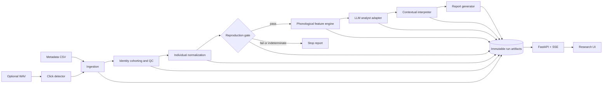

# Rosetta Coda — Architecture

Status: Implemented (as-built; SPECs 000–013)  
Date: 2026-07-12 · revised post-implementation

## Requirements

Rosetta Coda is a local-first research instrument for generating falsifiable phonological hypotheses about sperm-whale codas. It is not a translator and has no semantic ground truth.

Assumptions for this design:

- Initial team: one engineer plus researcher review.
- Initial scale: local corpora up to roughly one million codas; batch analysis matters more than request throughput.
- Metadata is always supported; audio is optional.
- Every transformation is reproducible from immutable inputs, versioned code, configuration, and model identifiers.
- No downstream analysis may run until the published duration result passes its preregistered reproduction gate.

Scientific invariants:

1. Never emit claims of semantic meaning or intent.
2. Never use unresolved identities (`0`, `9999`, composite, uncertain) in individual baselines or individual-controlled inference.
3. Preserve unresolved rows in a separate cohort; never silently discard them.
4. Separate observed data, deterministic measurements, statistical estimates, and model-generated hypotheses.
5. Label uncertainty by kind: measurement, sampling, model, or epistemic.
6. Every hypothesis includes evidence references, confidence provenance, alternatives, and falsification conditions.
7. Failure or indeterminacy of a gate stops dependent stages. No post-hoc threshold changes.

## Architecture choice

A modular Python monolith. `scripts/run_pipeline.py` orchestrates the stages and owns no scientific calculations. Two consumers read the immutable artifacts: a versioned local FastAPI (`api/`) and static UIs (`demo/`, `research/`) that work with zero backend — which is also what the public Vercel deployment serves.



## Repository layout

```text
rosetta-coda/
  pyproject.toml
  uv.lock
  contracts/            # Pydantic models and exported JSON Schema
  data/                 # Metadata loaders, validation, provenance
  analysis/             # normalization, statistical gates, held-out calibration
  detector/             # optional WAV click/coda detection
  phonology/            # timing extraction + deterministic feature engine
  interpretation/       # analyst adapter + ranked, falsifiable hypotheses
  reporting/            # citable reports and limitations
  storage/              # manifests, hashes, atomic artifact writes
  api/                  # versioned local HTTP/SSE API (local only)
  demo/                 # SPEC-004 gate demo (static)
  research/             # research console over the sealed release (static)
  scripts/              # run_pipeline.py, run_foundation.py, replay_release.py
  specs/                # accepted implementation contracts
  tests/                # unit, integration, golden, fixture tests
  external/             # pinned upstream datasets; read-only
  artifacts/
    runs/               # ignored generated outputs
    release/            # sealed golden run (committed, hash-pinned)
    demo/  gates/       # demo-facing frozen artifacts
```

## Module boundaries

| Module | Responsibility | Owns | May depend on |
|---|---|---|---|
| `contracts` | Versioned wire and artifact schemas | JSON Schema | nothing internal |
| `ingestion` | CSV/audio import, schema checks, canonical rows | source manifests, canonical codas | `contracts`, `storage` |
| `identity` | Cohort assignment without identity invention | identity assignments | `contracts` |
| `analysis` | Baselines, z-scores, preregistered tests | baseline tables, gate results | `contracts` |
| `detector` | Envelope/click/coda detection from WAV | detections and detector metrics | `contracts` |
| `phonology` | Deterministic combinatorial features | feature records | `contracts`, `analysis` |
| `interpretation` | Typed model calls, candidate ranking, non-semantic hypotheses and falsifiers | model call records, hypothesis records | `contracts` |
| `reporting` | Evidence assembly and limitations | reports | all stage contracts, read-only |
| `scripts` | Pipeline orchestration: dependency order, gate stop, manifest | run state | public module interfaces only |
| `storage` | Atomic immutable artifacts and content hashes | run filesystem | `contracts` |
| `api` | Local read/stream surface | no scientific data | `storage`, `contracts` |

Numeric modules never import FastAPI, UI, or provider SDKs. The model adapter never mutates observations or deterministic measurements, and requires a `pass` gate plus a frozen evidence bundle before any call.

## Core contracts

Every artifact carries `schema_version`; the run `manifest.json` binds `run_id`, input SHA-256s, and the SHA-256 of every artifact, so `created_at`/`code_revision` provenance is content-addressed rather than embedded per file.

`CodaRecord`:

```json
{
  "coda_id": "dominica:1234",
  "source": "metadata",
  "source_ref": {"dataset": "DominicaCodas.csv", "row": 1234},
  "click_count": 5,
  "duration_s": 0.91,
  "icis_s": [0.20, 0.22, 0.24, 0.25],
  "coda_type": "5R1",
  "whale_id_raw": "5586",
  "identity_status": "resolved",
  "unit": "A",
  "clan": "EC1"
}
```

`EvidenceTrace` replaces any promise of raw private chain-of-thought. Evidence references are JSON Pointers into the frozen analyst-evidence bundle, validated at rank time:

```json
{
  "claim_id": "hyp-001",
  "claim_kind": "phonological_hypothesis",
  "claim": "...",
  "evidence_refs": ["/gate/per_whale_effects/0/raw_diff_a_minus_i", "/features/partition_contrasts/2/a_minus_i"],
  "alternatives": ["individual timing variation"],
  "uncertainty": {"kind": "model", "label": "heuristic"},
  "falsifiers": ["effect disappears in held-out resolved whales"]
}
```

Until empirical calibration exists, confidence is labeled `heuristic`, never presented as a frequentist confidence interval or calibrated probability.

## Identity and normalization contract

- `resolved`: one unambiguous, non-sentinel whale label.
- `unresolved_unknown`: `0` or `9999`.
- `unresolved_composite`: label contains `/`.
- `unresolved_uncertain`: label contains `?`.
- Unknown aliases or suspected typos remain unresolved until a versioned researcher-approved mapping exists.

For each resolved whale with at least two valid durations and non-zero sample standard deviation:

`baseline_mean = mean(duration_s)`  
`baseline_sd = sample_sd(duration_s, ddof=1)`  
`duration_z = (duration_s - baseline_mean) / baseline_sd`

Baselines are fitted only on the analysis partition defined by the spec. The unresolved cohort receives `duration_z = null` and separate descriptive summaries.

## Reproduction gate

Before implementation, `SPEC-004` freezes:

- coda-level a/i label source and mapping;
- inclusion/exclusion rules;
- minimum within-whale support;
- primary effect statistic;
- bootstrap/permutation seed and iterations;
- success, failure, and indeterminate criteria;
- sensitivity analyses.

Primary estimand as implemented: a linear mixed-effects model on `codamd.csv` duration with vowel code as fixed effect and whale as random effect; pass requires the published negative coefficient for `i` within the preregistered tolerance plus same-direction within-whale effects. Failure stops downstream stages. Insufficient eligible data is `indeterminate`, not failure and not success.

Resolved blocker: verified coda-level `a/i` labels come from `external/phonology-osf-9t6qu/codamd.csv` (Beguš phonology release), joined back to `DominicaCodas.csv` on coda number for timing data. The gate returned `pass` (628 observations, four whales; see `artifacts/gates/spec-004-duration-gate.json`).

## Run storage

```text
artifacts/runs/{run_id}/
  manifest.json
  spec-002-load.json
  spec-003-normalization.json
  spec-004-duration-gate.json
  spec-005-extraction.json
  spec-007-phonology.jsonl
  spec-007-featureset.json
  spec-008-analyst-evidence.json
  spec-008-model-calls.jsonl
  spec-009-ranked-hypotheses.json(.jsonl)
  spec-010-report.json / .md
  spec-012-calibration.json
  events.jsonl
```

`{run_id}` is `pipeline-<dataset-sha12>-<codamd-sha12>`: identical inputs always produce the same run id and the same deterministic artifacts (see `scripts/replay_release.py`).

Writes use temporary files plus atomic rename. Finalized artifacts are immutable. Manifest contains SHA-256 hashes for every input/output. LLM calls store request schema, model ID, provider parameters, response, usage, and cache key; secrets are never persisted.

## API contracts

| Method | Path | Purpose |
|---|---|---|
| `POST` | `/v1/runs` | Start run from validated config; idempotency key required |
| `GET` | `/v1/runs/{run_id}` | Run state and gate status |
| `GET` | `/v1/runs/{run_id}/events` | SSE stage/evidence events |
| `GET` | `/v1/runs/{run_id}/codas` | Cursor-paginated coda/features view |
| `GET` | `/v1/runs/{run_id}/artifacts/{name}` | Fetch immutable artifact |

Errors use `{ "error": { "code": "...", "message": "...", "details": {} } }`.

## ADRs

### ADR-001 — Modular monolith

- Status: Accepted
- Context: Small team, coupled scientific stages, local batch workload.
- Decision: One Python package with enforced module boundaries.
- Consequences: Simple deployment and reproducibility; modules can be extracted later.
- Alternatives: Microservices rejected as operational overhead without independent scaling need.

### ADR-002 — Local immutable artifacts as source of truth

- Status: Accepted
- Context: Full replay and auditability required.
- Decision: Versioned JSON/JSONL artifacts plus hash manifest; optional SQLite index is disposable.
- Consequences: Human-readable audit trail; larger numeric corpora may later add Parquet as a derived artifact.
- Alternatives: Database-only persistence rejected because export/replay becomes implicit.

### ADR-003 — Deterministic science outside LLM

- Status: Accepted
- Context: Numeric results must be reproducible; model outputs are non-deterministic.
- Decision: Extraction, normalization, statistics, and feature measurement are pure versioned code. LLM only proposes structured hypotheses over frozen evidence.
- Consequences: Strong audit boundary; less flexibility for model-led feature invention.
- Alternatives: End-to-end LLM analyst rejected as unauditable.

### ADR-004 — Evidence trace, not raw chain-of-thought

- Status: Accepted
- Context: Researchers require auditability, while private model reasoning is neither a stable API nor valid evidence.
- Decision: Persist structured claims, evidence, transformations, alternatives, uncertainty, and falsifiers.
- Consequences: Auditable scientific rationale without claiming access to hidden reasoning.
- Alternatives: Storing free-form hidden reasoning rejected as irreproducible and provider-dependent.

## Dependency assessment

Python 3.11+; all dependencies pinned in `uv.lock` (pydantic, pandas, numpy, statsmodels, openai-compatible SDK, fastapi/starlette for the local API). The model provider is OpenAI-compatible: `ROSETTA_API_KEY`/`ROSETTA_BASE_URL`/`ROSETTA_MODEL` (DeepSeek defaults; see `docs/model-provider-research.md`). Numeric modules carry no provider SDK dependency.

## Risks

| Risk | Impact | Likelihood | Mitigation |
|---|---|---|---|
| Missing verified a/i labels | Gate cannot run | High | Acquire cited label source; never infer mapping |
| 65% unknown whale IDs | Lower controlled sample | High | Separate cohort; publish eligibility flow |
| Optional/no audio | Spectral and edge-click claims unavailable | High | Capability flags and metadata-only limitations |
| LLM nondeterminism | Replay differs | Medium | Typed calls, cache, pinned model ID, frozen evidence |
| Uncalibrated confidence | Misleading certainty | High | Mark heuristic until held-out calibration |
| Data leakage across whales/bouts | Inflated performance | Medium | Grouped splits and preregistered partitions |
| Semantic overclaim | Invalid scientific output | Medium | Schema lint, forbidden-claim tests, report disclaimer |
| Upstream data drift | Irreproducible results | Medium | Pin commit and hash every file |
