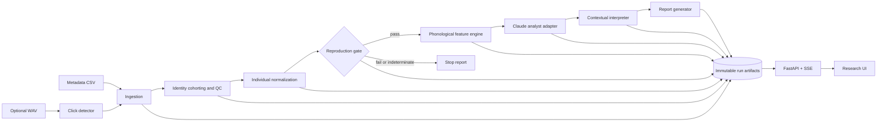

# Rosetta Coda — Architecture

Status: Proposed  
Date: 2026-07-12

## Requirements

Rosetta Coda is a local-first research instrument for generating falsifiable phonological hypotheses about sperm-whale codas. It is not a translator and has no semantic ground truth.

Assumptions for this design:

- Initial team: one engineer plus researcher review.
- Initial scale: local corpora up to roughly one million codas; batch analysis matters more than request throughput.
- Metadata is always supported; audio is optional.
- Every transformation is reproducible from immutable inputs, versioned code, configuration, and model identifiers.
- No downstream analysis may run until the published duration result passes its preregistered reproduction gate.

Scientific invariants:

1. Never emit claims of semantic meaning or intent.
2. Never use unresolved identities (`0`, `9999`, composite, uncertain) in individual baselines or individual-controlled inference.
3. Preserve unresolved rows in a separate cohort; never silently discard them.
4. Separate observed data, deterministic measurements, statistical estimates, and model-generated hypotheses.
5. Label uncertainty by kind: measurement, sampling, model, or epistemic.
6. Every hypothesis includes evidence references, confidence provenance, alternatives, and falsification conditions.
7. Failure or indeterminacy of a gate stops dependent stages. No post-hoc threshold changes.

## Architecture choice

Use a modular monolith with ports and adapters. Python owns scientific computation and orchestration; a separate TypeScript web client consumes a versioned local API. LangGraph coordinates stages but contains no scientific calculations.



## Repository layout

```text
rosetta-coda/
  pyproject.toml
  uv.lock
  contracts/            # Pydantic models and exported JSON Schema
  data/                 # Metadata loaders, validation, provenance
  analysis/             # normalization and statistical gates
  detector/             # optional WAV click/coda detection
  phonology/             # deterministic rhythm/tempo/ornament/rubato features
  llm/                   # provider-neutral ports; Claude adapter
  interpretation/       # ranked, falsifiable hypotheses
  reporting/            # citable reports and limitations
  orchestration/        # LangGraph state and stage transitions
  storage/              # manifests, hashes, atomic artifact writes
  api/                  # versioned local HTTP/SSE API
  web/                   # waveform, time-time plot, evidence trace
  specs/                 # accepted implementation contracts
  tests/
    unit/
    integration/
    fixtures/
    golden/
  external/              # pinned upstream datasets/repos; read-only
  artifacts/runs/        # ignored generated outputs
```

## Module boundaries

| Module | Responsibility | Owns | May depend on |
|---|---|---|---|
| `contracts` | Versioned wire and artifact schemas | JSON Schema | nothing internal |
| `ingestion` | CSV/audio import, schema checks, canonical rows | source manifests, canonical codas | `contracts`, `storage` |
| `identity` | Cohort assignment without identity invention | identity assignments | `contracts` |
| `analysis` | Baselines, z-scores, preregistered tests | baseline tables, gate results | `contracts` |
| `detector` | Envelope/click/coda detection from WAV | detections and detector metrics | `contracts` |
| `phonology` | Deterministic combinatorial features | feature records | `contracts`, `analysis` |
| `llm` | Typed model calls, cache, model provenance | model call records | `contracts` |
| `interpretation` | Non-semantic hypotheses and falsifiers | hypothesis records | `contracts` |
| `reporting` | Evidence assembly and limitations | reports | all stage contracts, read-only |
| `orchestration` | Dependency gates, retries, checkpoints | run state | public module interfaces only |
| `storage` | Atomic immutable artifacts and content hashes | run filesystem | `contracts` |
| `api` | Local read/execute/stream surface | no scientific data | orchestration, storage |

Numeric modules never import LangGraph, FastAPI, UI, or provider SDKs. LLM modules never mutate observations or deterministic measurements.

## Core contracts

Every artifact includes `schema_version`, `run_id`, `created_at`, `code_revision`, `config_hash`, `input_hashes`, and `producer`.

`CodaRecord`:

```json
{
  "coda_id": "dominica:1234",
  "source": "metadata",
  "source_ref": {"dataset": "DominicaCodas.csv", "row": 1234},
  "click_count": 5,
  "duration_s": 0.91,
  "icis_s": [0.20, 0.22, 0.24, 0.25],
  "coda_type": "5R1",
  "whale_id_raw": "5586",
  "identity_status": "resolved",
  "unit": "A",
  "clan": "EC1"
}
```

`EvidenceTrace` replaces any promise of raw private chain-of-thought:

```json
{
  "claim_id": "hyp-001",
  "claim_kind": "phonological_hypothesis",
  "claim": "...",
  "evidence_refs": ["stage-01/codas.jsonl#dominica:1234"],
  "transformations": ["individual_zscore:v1"],
  "alternatives": ["individual timing variation"],
  "uncertainty": {"kind": "epistemic", "estimate": 0.42, "calibration_version": null},
  "falsifiers": ["effect disappears in held-out resolved whales"]
}
```

Until empirical calibration exists, confidence is labeled `heuristic`, never presented as a frequentist confidence interval or calibrated probability.

## Identity and normalization contract

- `resolved`: one unambiguous, non-sentinel whale label.
- `unresolved_unknown`: `0` or `9999`.
- `unresolved_composite`: label contains `/`.
- `unresolved_uncertain`: label contains `?`.
- Unknown aliases or suspected typos remain unresolved until a versioned researcher-approved mapping exists.

For each resolved whale with at least two valid durations and non-zero sample standard deviation:

`baseline_mean = mean(duration_s)`  
`baseline_sd = sample_sd(duration_s, ddof=1)`  
`duration_z = (duration_s - baseline_mean) / baseline_sd`

Baselines are fitted only on the analysis partition defined by the spec. The unresolved cohort receives `duration_z = null` and separate descriptive summaries.

## Reproduction gate

Before implementation, `SPEC-004` freezes:

- coda-level a/i label source and mapping;
- inclusion/exclusion rules;
- minimum within-whale support;
- primary effect statistic;
- bootstrap/permutation seed and iterations;
- success, failure, and indeterminate criteria;
- sensitivity analyses.

Recommended primary estimand: within-whale mean difference `mean(z_duration_a) - mean(z_duration_i)`, aggregated across eligible whales with a whale-cluster bootstrap. Pass requires positive effect and 95% interval above zero. Failure stops stages 2–4. Insufficient eligible data is `indeterminate`, not failure and not success.

Current blocker: `DominicaCodas.csv` has `CodaType` but no explicit, verified coda-level `a/i/ī` quality column or spectral formants. No mapping from coda type to vowel quality may be invented. `SPEC-004` cannot be accepted until the label source is verified from Beguš data/code or a cited operational mapping.

## Run storage

```text
artifacts/runs/{run_id}/
  manifest.json
  config.json
  inputs/source-manifest.json
  stage-01/codas.jsonl
  stage-01/qc.json
  stage-02/baselines.jsonl
  stage-02/normalized-codas.jsonl
  stage-02/reproduction-gate.json
  stage-03/phonology.jsonl
  stage-03/model-calls.jsonl
  stage-04/hypotheses.jsonl
  report/report.json
  report/report.md
  events.jsonl
```

Writes use temporary files plus atomic rename. Finalized artifacts are immutable. Manifest contains SHA-256 hashes for every input/output. LLM calls store request schema, model ID, provider parameters, response, usage, and cache key; secrets are never persisted.

## API contracts

| Method | Path | Purpose |
|---|---|---|
| `POST` | `/v1/runs` | Start run from validated config; idempotency key required |
| `GET` | `/v1/runs/{run_id}` | Run state and gate status |
| `GET` | `/v1/runs/{run_id}/events` | SSE stage/evidence events |
| `GET` | `/v1/runs/{run_id}/codas` | Cursor-paginated coda/features view |
| `GET` | `/v1/runs/{run_id}/artifacts/{name}` | Fetch immutable artifact |

Errors use `{ "error": { "code": "...", "message": "...", "details": {} } }`.

## ADRs

### ADR-001 — Modular monolith

- Status: Proposed
- Context: Small team, coupled scientific stages, local batch workload.
- Decision: One Python package with enforced module boundaries.
- Consequences: Simple deployment and reproducibility; modules can be extracted later.
- Alternatives: Microservices rejected as operational overhead without independent scaling need.

### ADR-002 — Local immutable artifacts as source of truth

- Status: Proposed
- Context: Full replay and auditability required.
- Decision: Versioned JSON/JSONL artifacts plus hash manifest; optional SQLite index is disposable.
- Consequences: Human-readable audit trail; larger numeric corpora may later add Parquet as a derived artifact.
- Alternatives: Database-only persistence rejected because export/replay becomes implicit.

### ADR-003 — Deterministic science outside LLM

- Status: Proposed
- Context: Numeric results must be reproducible; model outputs are non-deterministic.
- Decision: Extraction, normalization, statistics, and feature measurement are pure versioned code. LLM only proposes structured hypotheses over frozen evidence.
- Consequences: Strong audit boundary; less flexibility for model-led feature invention.
- Alternatives: End-to-end LLM analyst rejected as unauditable.

### ADR-004 — Evidence trace, not raw chain-of-thought

- Status: Proposed
- Context: Researchers require auditability, while private model reasoning is neither a stable API nor valid evidence.
- Decision: Persist structured claims, evidence, transformations, alternatives, uncertainty, and falsifiers.
- Consequences: Auditable scientific rationale without claiming access to hidden reasoning.
- Alternatives: Storing free-form hidden reasoning rejected as irreproducible and provider-dependent.

## Dependency assessment

Current application has no `pyproject.toml`, lockfile, package graph, or implemented modules. Only `scripts/inspect_schema.py` depends on pandas; therefore coupling and circular-dependency metrics are not yet meaningful. Pin Python 3.11 and all dependencies with `uv.lock` in `SPEC-001`.

## Risks

| Risk | Impact | Likelihood | Mitigation |
|---|---|---|---|
| Missing verified a/i labels | Gate cannot run | High | Acquire cited label source; never infer mapping |
| 65% unknown whale IDs | Lower controlled sample | High | Separate cohort; publish eligibility flow |
| Optional/no audio | Spectral and edge-click claims unavailable | High | Capability flags and metadata-only limitations |
| LLM nondeterminism | Replay differs | Medium | Typed calls, cache, pinned model ID, frozen evidence |
| Uncalibrated confidence | Misleading certainty | High | Mark heuristic until held-out calibration |
| Data leakage across whales/bouts | Inflated performance | Medium | Grouped splits and preregistered partitions |
| Semantic overclaim | Invalid scientific output | Medium | Schema lint, forbidden-claim tests, report disclaimer |
| Upstream data drift | Irreproducible results | Medium | Pin commit and hash every file |
