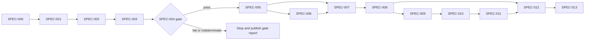

# Rosetta Coda — Spec-driven roadmap

Status: Proposed  
Planning assumption: one engineer plus researcher review. Replan every four weeks or after any scientific gate.

## Operating model

Each unit starts as `specs/SPEC-NNN-title.md`. Implementation begins only after status becomes `Accepted`. Every spec defines contracts, scientific assumptions, exclusions, tests, artifacts, and a stop condition. Completion requires an evidence bundle, not only merged code.

Priority follows scientific dependency and risk. RICE is intentionally not used: reach and business impact are not measurable for this pre-validation research tool, so numeric scores would create false precision.

## Now — 0–6 weeks, committed

Outcome: researchers can load the primary corpus, separate unresolved identities, normalize valid individuals, and determine whether the published duration result reproduces without analytic flexibility.

| Spec | Deliverable | Acceptance gate | Depends on |
|---|---|---|---|
| `SPEC-000` | Scientific contract and forbidden claims | Researcher approves invariants and failure language | none |
| `SPEC-001` | Project bootstrap, schemas, provenance, immutable run writer | clean `uv sync`; JSON round-trip; hash replay | 000 |
| `SPEC-002` | Validated metadata loader and identity cohorting | 8,719 primary rows; 13 units; unresolved counts fixed by golden test | 001 |
| `SPEC-003` | Per-whale baseline and z-score module | unresolved rows never normalized; synthetic/statistical tests pass | 002 |
| `SPEC-004` | Preregistered a/i duration reproduction gate | verified labels; frozen analysis; pass/fail/indeterminate artifact | 003 |

Hard stop: no later spec starts unless `SPEC-004` returns `pass`. If label data is unavailable, result is `indeterminate` and roadmap pauses at evidence acquisition.

## Next — 6–12 weeks, conditional on gate

Outcome: researchers can derive reproducible phonological measurements from metadata and optional audio, then obtain constrained hypotheses grounded in those measurements.

| Spec | Deliverable | Acceptance gate | Depends on |
|---|---|---|---|
| `SPEC-005` | Metadata-first Coda Extractor | canonical ICI round-trip within `1e-6`; QC report | 004 pass |
| `SPEC-006` | Optional Python WAV detector | parity suite against published MATLAB examples; detector metrics | 005 |
| `SPEC-007` | Deterministic phonological feature engine | rhythm/tempo fixtures; ornament/rubato context tests | 005; 006 only for audio features |
| `SPEC-008` | Phonological Analyst adapter | schema-valid hypotheses; evidence refs resolve; no semantic claims | 007 |
| `SPEC-009` | Contextual Interpreter | ranked hypotheses include uncertainty type and falsifiers | 008 |

Audio-dependent outputs—spectral quality, formants, edge-click coarticulation—must return `not_observable` when WAV evidence is absent.

## Later — 12+ weeks, exploratory

Outcome: researchers can inspect, replay, compare, and cite complete analyses without losing provenance or limitations.

| Spec | Deliverable | Acceptance gate | Depends on |
|---|---|---|---|
| `SPEC-010` | Report generator | citation checks; mandatory limitations and “cannot conclude” sections | 009 |
| `SPEC-011` | Local API and research UI | waveform/time-time/evidence views replay golden run | 010 |
| `SPEC-012` | Confidence calibration and held-out evaluation | grouped whale/bout split; empirical calibration report | 008–011 |
| `SPEC-013` | Reproducible research release | clean-machine replay from locked environment and manifests | 012 |

## Dependency map

## Spec completion evidence

Every completed spec supplies:

- accepted spec hash;
- code revision and locked dependency hash;
- commands used for verification;
- concise test and coverage result;
- input/output artifact hashes;
- deviations from spec;
- scientific reviewer sign-off where marked;
- next spec unblocked, or explicit stop reason.

## Capacity

For one engineer, only one implementation spec is active. Researcher review blocks `SPEC-000`, label mapping in `SPEC-004`, detector parity in `SPEC-006`, and confidence language in `SPEC-012`. After `SPEC-004` passes, UI design may run in parallel with deterministic feature work, but UI implementation waits for stable contracts.

## Not doing

- Semantic translation or intent labels: no ground truth.
- End-to-end neural model before deterministic gate: prevents attribution and audit.
- Audio corpus training: DSWP raw audio is not openly available.
- Microservices or cloud deployment: no current scale or collaboration requirement.
- Automated identity resolution: ambiguous labels require researcher-approved evidence.
- Raw private chain-of-thought display: replaced by structured evidence trace.
- Confidence percentages presented as calibrated before `SPEC-012`.

## Immediate next decision

Write and accept `SPEC-000`, then `SPEC-001`. In parallel, locate the verified coda-level a/i/ī labels or operational mapping required by `SPEC-004`; this is the critical scientific dependency.

